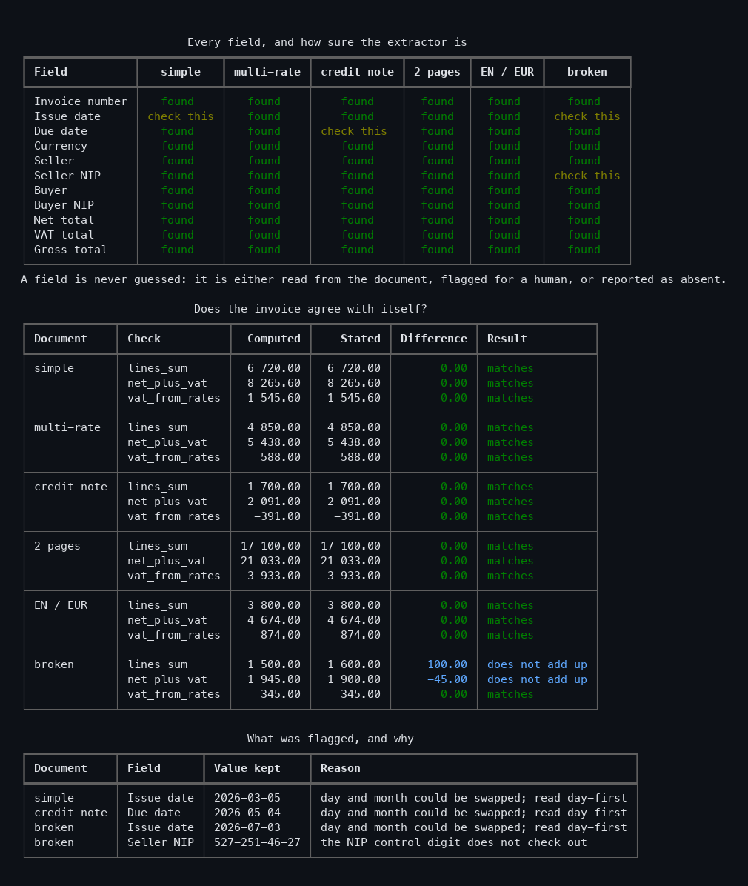
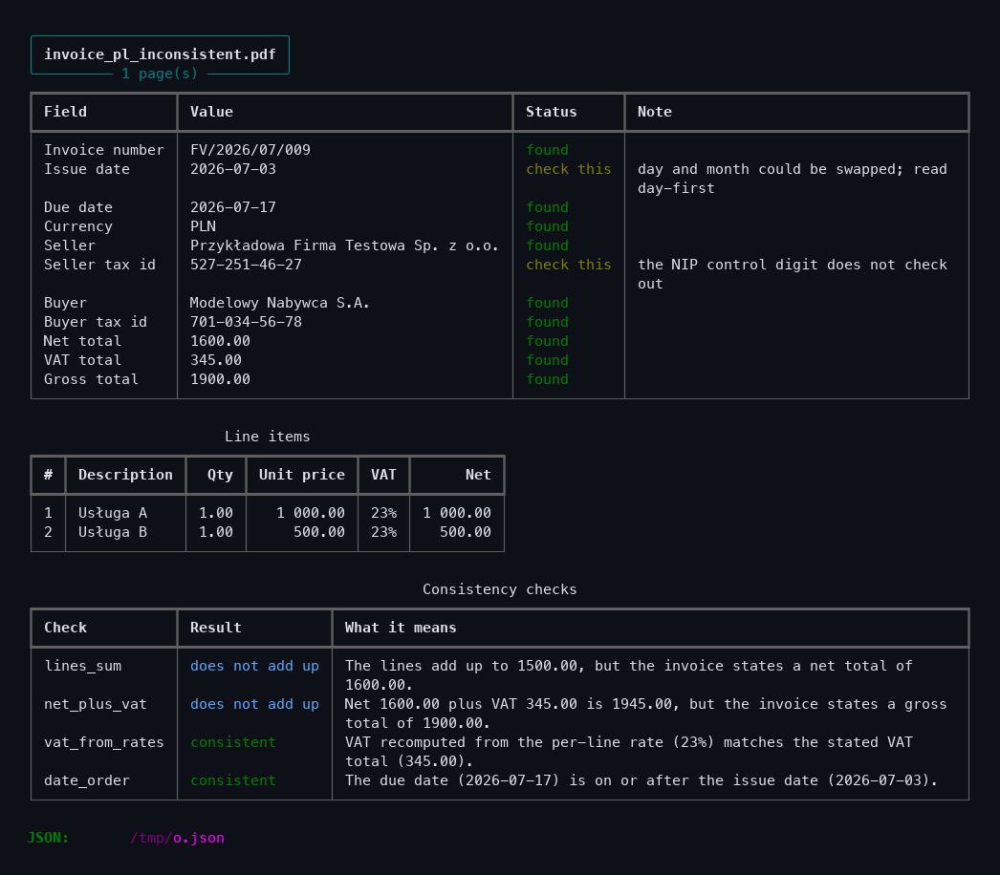

# doc-extractor

Pulls structured data out of text-based invoice PDFs, and checks that the numbers on the
invoice agree with each other.



The overview above comes from one command, which runs the extractor over the six bundled
sample invoices:

```bash
./.venv/bin/python -m doc_extractor demo
```

## Context

This is a personal tool, written by its author for his own freelance work. It has no
client, no users other than its author, and it has never been sold or deployed. It exists
because invoice handling — *faktury* — is one of the jobs that keeps appearing on the
freelance boards he works from.

## What it does

For each PDF:

- **extracts the header fields** — invoice number, issue and due dates, currency, seller
  and buyer with their names, addresses and tax ids;
- **extracts the line items** — description, quantity, unit price, VAT rate, net amount —
  including tables that continue onto a second page;
- **checks the arithmetic** — do the lines add up to the net total, does net plus VAT equal
  the gross total, does the VAT recomputed from the per-line rates match the stated one;
- **writes JSON and CSV**, and prints a report you can read without opening the PDF.

## Two rules it does not break

**A field is never guessed.** Every extracted value carries a status:

| Status | Meaning |
|---|---|
| **found** | A label was matched and the value read cleanly. |
| **check this** | Something was read but the evidence is weak — an ambiguous date, a tax id whose control digit fails, a document mentioning two currencies. The value is given *and* flagged. |
| **not found** | Nothing usable was found. The value is `null`, and the note says what was looked for. |

There is no fourth case where a plausible value is invented. A test asserts that a document
with no invoice content produces eleven `missing` fields and no values at all.

**A mismatch is reported, never corrected.** If the lines add up to 1500 and the invoice
says 1600, both numbers appear in the report along with the difference. Silently rewriting
one of them would destroy the only signal worth having.

## Polish invoices first

The tool was written for the Polish market, so:

- labels are matched in Polish first (`Faktura VAT nr`, `Data wystawienia`, `Termin
  płatności`, `Sprzedawca`, `Nabywca`, `Razem netto/VAT/brutto`, `Do zapłaty`), with
  English equivalents alongside;
- Polish month names are understood (`12 kwietnia 2026`);
- `zw.` and `np.` — the VAT exemption markers — are read as a zero rate, so exempt lines do
  not break the VAT recomputation;
- **the NIP control digit is verified.** A Polish NIP ends in a modulo-11 checksum over its
  first nine digits. A NIP that fails it is reported as *check this* rather than copied out
  as if it were fine — that is the difference between passing a typo along and catching it.

## Install and run

```bash
python3 -m venv .venv
./.venv/bin/pip install -r requirements.txt
```

```bash
./.venv/bin/python -m doc_extractor extract samples/invoice_pl_simple.pdf
```

Several files, with every output:

```bash
./.venv/bin/python -m doc_extractor extract samples/*.pdf \
    --json invoices.json --fields-csv fields.csv --lines-csv lines.csv --summary-only
```

| Option | Effect |
|---|---|
| `--json out.json` | Full result, with confidence and evidence per field |
| `--fields-csv f.csv` | One row per extracted field |
| `--lines-csv l.csv` | One row per invoice line |
| `--export-png run.png` | Save the console output as an image |
| `--summary-only` | One row per document instead of the full detail |
| `--no-lines` | Hide the line-item tables |
| `--width 120` | Force the output width, for redirected output |
| `--fail-on-error` | Exit with code 2 if any document does not add up |

There is also a `demo` command, which runs over the bundled samples and prints the field
matrix, the arithmetic table and the list of flagged values shown at the top of this page.
It writes nothing:

```bash
./.venv/bin/python -m doc_extractor demo --export-png demo.png
```

A single document in full detail:



Exit codes: `0` success, `1` nothing could be extracted, `2` extraction succeeded but a
document does not add up (only with `--fail-on-error`).

One unreadable file does not abort a batch: it is reported and the run continues.

## Scanned documents are not supported

This version reads the **text layer** of a digital PDF — the kind produced by invoicing
software. A scan has no text layer, and the tool refuses it explicitly:

```
Skipped scan.pdf: scan.pdf has no text layer (0 characters found).
This looks like a scan; scanned documents are not supported.
```

That is deliberate. OCR would add an error rate that the author cannot measure or control,
and shipping it would mean selling a capability he cannot vouch for.

**The architecture leaves room for it.** Extraction never opens a PDF: it works on `Page`
objects handed to it by a `TextSource` ([`sources.py`](doc_extractor/sources.py)). An
OCR-backed source would implement the same three members — `name`, `supports`, `read` — and
the field patterns, line extraction, arithmetic checks and outputs would keep working
unchanged. `Word` already carries coordinates for that reason, since an OCR engine returns
boxes.

## Design decisions worth explaining

- **Parties are split by coordinate, not by text.** On a normal invoice the seller and buyer
  sit side by side, so `"NIP: 5272514626 NIP: 7010345678"` is a *single* line of text
  holding one value for each of them. They are separated using the x position of each word
  ([`extract.py`](doc_extractor/extract.py)).
- **The column boundary is where the right block starts, not the middle of the page.** A
  long company name easily runs past the centre; splitting at the midpoint moved the tail of
  the seller's name into the buyer's block. There is a test for exactly that.
- **The party block is bounded vertically too**, between the headings and the top of the
  item table, otherwise the document title — which spans both columns — is read as a name.
- **Line items are read right to left.** The trailing columns are always in the same order,
  while a description can itself contain numbers (`Hosting aplikacji (12 miesięcy)`).
- **Amounts are `Decimal` everywhere and are written to JSON as strings**, so a consumer
  reading them back does not pick up a binary rounding error on money.
- **Rounding tolerance is one grosz on the recomputed VAT.** Per-line rounding legitimately
  drifts; a strict equality would raise errors on perfectly correct invoices.
- **A row that could not be read suppresses the sum check.** Otherwise the tool would blame
  the invoice for its own extraction failure.

## Tests

```bash
./.venv/bin/pip install -r requirements-dev.txt
python samples/make_invoices.py     # generate the sample PDFs first
./.venv/bin/python -m pytest tests/ -q
```

**103 tests, all passing**, run against the six generated invoices:

| Area | Examples covered |
|---|---|
| Values | Polish month names, ISO/dotted/slashed dates, ambiguous day-month order, four amount conventions, accounting negatives, currency codes, `zw.`/`np.` exemptions, NIP checksum valid and invalid |
| Sources | A PDF with no text layer is refused with a message naming the cause; words carry real coordinates |
| Fields | Every header field on each sample; a long seller name not being cut at mid-page; a document with no invoice content producing only `missing` fields |
| Lines | 18 items across a page break, three different VAT rates including an exempt one, negative amounts on a credit note, a description containing a number, space-separated thousands, the totals row not being read as an item |
| Checks | Each check passing and failing, a missing total downgrading to incomplete rather than failing, one-grosz tolerance, skipped rows suppressing a false mismatch, and that checks never modify the invoice |
| Output | Confidence kept beside each value, amounts written as strings, missing fields as `null`, BOM for Excel |
| CLI | Every exit code, a scan skipped without losing the rest of the batch, forced width |
| Demo | The overview covers every sample, shows the arithmetic gap, and explains each flagged field |

## Sample documents

The six PDFs in `samples/` are **generated and entirely invented** — company names,
addresses, tax ids, invoice numbers, descriptions and amounts refer to no real business.
Regenerate them with `python samples/make_invoices.py`. They cover a simple single-rate
invoice, several VAT rates, a credit note with negative amounts, an invoice whose items run
over two pages, an English/EUR invoice, and one whose totals deliberately do not add up and
whose tax id has a wrong control digit.

The generator refuses to run unless it finds a font with full Polish coverage. reportlab's
default Helvetica silently substitutes wrong glyphs for `ą ć ę ł ń ó ś ź ż`, which would
have made the samples a poor stand-in for real invoices — and would have quietly tuned the
label patterns against broken text.

## Limitations, and what is not covered

- **Never used on a real invoice.** Everything here has been run against the six generated
  samples. No real supplier document, and no paying engagement, has gone through it.
- **Scans are not supported.** See above.
- **Six generated layouts is a narrow sample.** Real invoices vary enormously between
  invoicing packages; a layout that puts the totals in a side panel, or splits the seller
  block across the page, will extract badly. The label lists in
  [`patterns.py`](doc_extractor/patterns.py) are where that would be widened.
- **Only one invoice per PDF.** A file containing several invoices is read as one.
- **Ambiguous dates are resolved day-first** and flagged, but flagged is not solved: on a US
  invoice the flagged value will be wrong.
- **VAT is recomputed only when every line carries a rate.** An invoice with a per-rate
  summary table but no rate on each line is not cross-checked that way.
- **No per-rate VAT breakdown.** The Polish `tabela stawek VAT` block is not read; VAT is
  checked in total and, when possible, recomputed from the lines.
- **Bank account, payment method and delivery dates are not extracted.**
- **The PNG export reads `rich`'s recording buffer through a private attribute**
  (`Console._record_buffer`). It works on the pinned version and is tested, but a future
  release of `rich` could rename it; the failure would be loud, and the JSON and CSV outputs
  do not depend on it.
